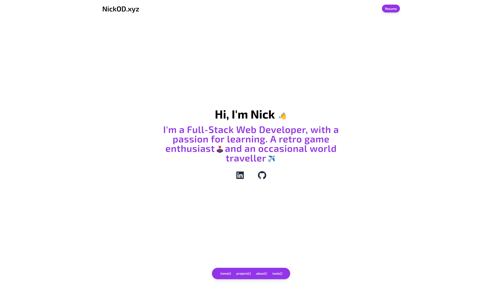

<h1 align="center">Personal Portfolio | NickOD.xyz</h1>



<br>

This is a [Next.js](https://nextjs.org/) project bootstrapped with [`create-next-app`](https://github.com/vercel/next.js/tree/canary/packages/create-next-app).

## Getting Started

First, run the development server:

```bash
npm install
#
npm run dev
# or
yarn dev
# or
pnpm dev
```

Open [http://localhost:3000](http://localhost:3000) with your browser to see the result.

## Overview

This is my personal portfolio website. I decided to recreate the site in React using Next.js and TailwindCSS for styling and also using Jest and react-testing-library for unit testing.

This portfolio site features a modular data structure, enabling easy customization for anyone with the source code. By separating the site's content into separate files, individuals can effortlessly update and personalize the data to reflect their own projects, about, and tools they use. This approach allows users to download the source code and quickly make the site their own by updating the data files in app/data/.

<br>

## Sticking Points & What I learned

- Testing

This is the first time I've used any kind of testing in my react aps. So it was interesting leanring for me. Understanding the flow of writting a test and piecing the test together to make sure it worked as needed. Learning about adding a data-testid prop into my jsx so I could the reference the elements I was running the tests on was nice.

- Testing Structure
  - Define the test with test
  - Render the component you are running the test on
  - Grab the element you want to test from the rendered component
  - Define the expectation

While I'm sure the tests I implemented are very basic ones, it was good to learn the basic structure of writting a test.

<br>

## Built with

- Mobile First Workflow
- TailwindCSS
  - Flexbox
- React Components
  - Client Components
  - Server Components
- Testing
  - Jest
  - react-testing-library

<br>

## Author

- Website - [NickOD.xyz](http://www.NickOD.xyz)
- My LinkedIn - [LinkedIn](https://www.linkedin.com/in/nick-odonoghue/)

<br>

## Useful Resources

[React Docs](https://react.dev/learn)

[Next.js Docs](https://nextjs.org/docs)

[Jest Docs](https://jestjs.io/docs/getting-started)

<br>

## Acknowledgments

[Le Wagon](https://www.lewagon.com/) & all the teachers, TAs and classmates from <em>1122</em>
